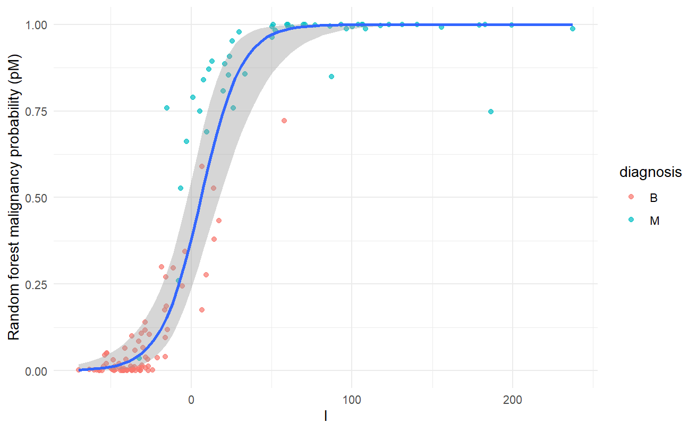
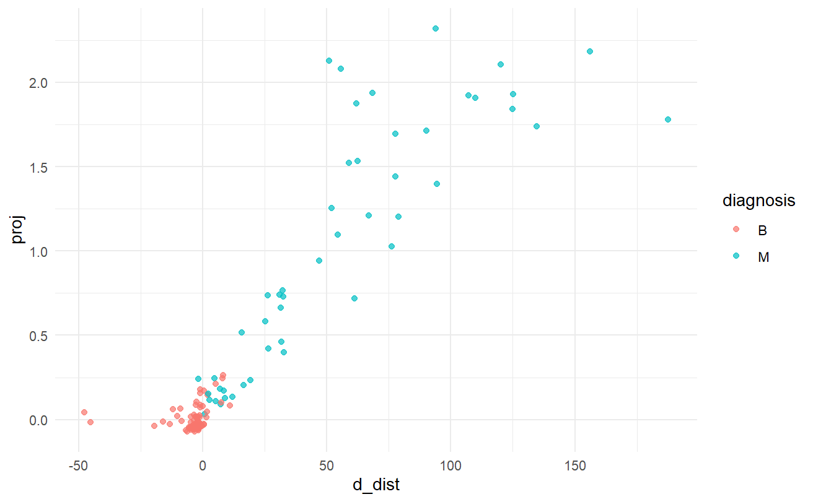
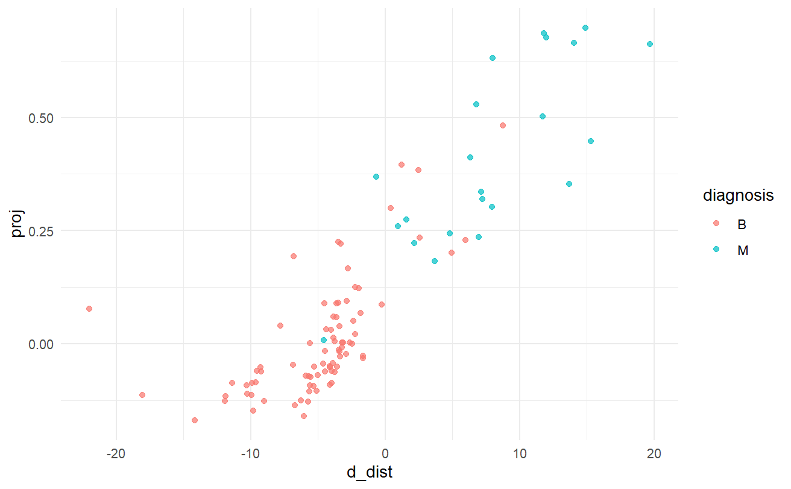

```{r, message=FALSE}

library(here)
library(tibble)
library(ranger)
library(ggplot2)

source(here("v2","src","evidencegeom.R"))
source(here("v2","src","bcw_train_test_split.R"))

set.seed(42)


```


## Dataset 1: BCW

## TL;DR

This notebook demonstrates the **Evidence Geometry** framework on the **Breast Cancer Wisconsin** dataset.

Instead of relying only on classifier probability, the framework analyzes each case by collecting log likelihood ratios between classes by selecting marginal likelihood distribution families for each feature based on feature type and magnitude of log likelihood.

This log-likelihood ratio space (evidence space) is then analyzed using two geometric risk signals:

- **Distance Contrast (`d_dist`)**: measures which class manifold better explains the case
- **Drift Projection (`proj`)**: measures directional drift toward positive-class structure

### Validation Set Risk Map

<div style="text-align: center;">
  
  <p><em>Random Forest Probability scores vs sum of LLRs closely follow the Logistic regression curve between true class and sum of LLRs, suggesting that sum of LLRs has discriminatory power comparable to Random Forest</em></p>
</div>

<div style="text-align: center;">
  
  <p><em>Validation-set risk map.</em></p>
</div>

<div style="text-align: center;">
  
  <p><em>Validation-set risk map in the low-RF probability region  (p < 0.45).</em></p>
</div>


### Main Observation

Within the subset of cases assigned **low probability by the Random Forest (RF) classifier**, the two geometric signals reveal additional structure:

- Sum of LLRs produces decision boundary similar to Random Forest
- Boundary of ambiguity, d_dist = 0, occurs much earlier in the feature space than p = 0.5 classifier ambiguous region.
- Dominant benign cluster is present in the region d_dist < 0, proj < 0.
- Pathological cases are distinctly present among benign points that cross the benign central region of d_dist < 0 and proj < 0.

This suggests that geometric evidence can detect **hidden risk structure earlier than classifier probability alone**.

### Test Set Result

With a conservative triage policy on the test set, the risk signals help achieve:

- Identification of true ambiguity in data
- Abstention of classification of ambiguous cases
- **99.5%** false negative capture rate through abstention
- Maintain good automated classification rate at **95.6%**

### Takeaway

`d_dist` and `proj` provide a compact and interpretable view of **how risk accumulates geometrically**, especially in cases where standard discriminative classifiers assign deceptively low probability.


## Full Analysis

### Comment Block : Data prep from BCW raw data

```{r}

# bcw_import <- read.delim(file=here("src","data","bcw","wdbc.data"), sep=",", header=FALSE)
# names(bcw_import) <- c("id","diagnosis",
#                          "mean_radius","mean_texture","mean_perimeter","mean_area","mean_smoothness","mean_compactness","mean_concavity",
#                          "mean_concave_points","mean_symmetry", "mean_fractal_dimension",
#                          "se_radius","se_texture","se_perimeter","se_area","se_smoothness","se_compactness","se_concavity","se_concave_points",
#                          "se_symmetry", "se_fractal_dimension",
#                          "worst_radius","worst_texture","worst_perimeter","worst_area","worst_smoothness","worst_compactness","worst_concavity",
#                          "worst_concave_points","worst_symmetry", "worst_fractal_dimension")
# bcw_import$id <- as.factor(bcw_import$id)
# bcw_import$diagnosis <- as.factor(bcw_import$diagnosis)

```


```{r}

# bcw_split_1 <- enriched_split(
#    df = bcw_import,
#    rare_filter = quote(worst_perimeter >= 50 & worst_perimeter <= 105),
#    dev_frac = 0.65,
#    seed = 7
# )
# 
# bcw_split_2 <- enriched_split(
#    df = bcw_split_1$dev,
#    rare_filter = quote(worst_perimeter >= 50 & worst_perimeter <= 105),
#    dev_frac = 0.65,
#    seed = 7
# )
# 
# bcw_train <- bcw_split_2$dev
# bcw_val  <- bcw_split_2$test
# bcw_test <- bcw_split_1$test

```


```{r}

# write.csv(bcw_train, here("v2","src","data","bcw","bcw_train.csv"))
# write.csv(bcw_val, here("v2","src","data","bcw","bcw_val.csv"))
# write.csv(bcw_test, here("v2","src","data","bcw","bcw_test.csv"))


```

### Load Train-Val-Test splits  

Splits performed ensuring a proportion of known failure modes are present in all three splits

```{r}

bcw_train <- read.csv(here("v2","src","data","bcw","bcw_train.csv"))
bcw_train <- bcw_train[,-1]
bcw_train$id <- as.factor(bcw_train$id)
bcw_train$diagnosis <- as.factor(bcw_train$diagnosis)

bcw_val <- read.csv(here("v2","src","data","bcw","bcw_val.csv"))
bcw_val <- bcw_val[,-1]
bcw_val$id <- as.factor(bcw_val$id)
bcw_val$diagnosis <- as.factor(bcw_val$diagnosis)

bcw_test <- read.csv(here("v2","src","data","bcw","bcw_test.csv"))
bcw_test <- bcw_test[,-1]
bcw_test$id <- as.factor(bcw_test$id)
bcw_test$diagnosis <- as.factor(bcw_test$diagnosis)

```


#### Class overlap and hidden failures

```{r}

ggplot(bcw_train%>%filter(worst_perimeter >= 50 & worst_perimeter <= 150)) +
  geom_point(aes(x=worst_perimeter, y=worst_area, color=diagnosis), alpha=0.8) +
  labs(title="Class Overlap in the BCW dataset") +
  theme_minimal()

```

```{r}

nrow(bcw_train%>%filter(worst_perimeter >= 50 & worst_perimeter <= 105))

```


### Class Ratio to input for generating Evidence Space

```{r}

alpha <- (nrow(bcw_train[bcw_train$diagnosis=="M", ])/nrow(bcw_train))

```


## Evidence Space Transformation

**risk_spec** : Object to store function argument values for evidence space generation  

**fit** : Learn feature-wise marginal likelihoods, and geometries and eigenmodes of class manifolds in evidence space  

**loglik_matrices** : Compute marginal positive-class and negative-class evidences, and marginal relative evidence for input data using fitted evidence generator  

**score_risk** : Compute total feature-wise evidence, distance constrast, drift projection, and eigenmode energies  


### Generate Evidence Space

```{r, warning=FALSE}

bcw_spec <- risk_spec(
   y_col="diagnosis", positive="M",
   features = setdiff(names(bcw_train), c("diagnosis", "id")),
   alpha = alpha,
   laplace = 1, ridge = 1e-6, winsor_p=0.01,
   weights=FALSE,
   weight_method = "mutual_info",
   numeric_candidates = c("gaussian", "lognormal", "gamma"),
   numeric_val_frac = 0.2,
   numeric_min_n = 25,
   llr_cap_quantile = 0.01,
   mi_nbins = 10
 )

bcw_obj <- fit(bcw_train%>%select(-id), bcw_spec, k_eigen=2, k_energy=2, energy_ref="both")

```


```{r}

head(print_feature_likelihoods(bcw_obj), 5)

```


```{r}

bcw_Lval <- loglik_matrices(bcw_val%>%select(-id), bcw_obj$fit, alpha=bcw_spec$alpha)
# val/test scoring
bcw_scores_val <- bind_cols(id=bcw_val$id, 
                            diagnosis=bcw_val$diagnosis, 
                            score_risk(bcw_Lval$l_pos, bcw_Lval$l_neg,  bcw_obj$fit$weights, bcw_obj$geom, 
                                       bcw_spec$alpha, bcw_spec$eps))


```

Weighted evidence matrix using optional weights. Default weights (when selected) : KL separation between positive and negative classes per evidence

```{r}

bcw_Lval_w <- apply_llr_weights(bcw_Lval$L, bcw_obj$fit$weights)

```

### Learn baseline Random Forest and predict

```{r}

bcw_rf_train_1 <- ranger(formula = diagnosis ~ ., data=bcw_train%>%select(-id),
                         mtry=8, min.node.size=5, num.trees=500, probability = TRUE,
                         keep.inbag = TRUE)

```

```{r}

bcw_scores_val <- bind_cols(bcw_scores_val,
                            pM = predict(bcw_rf_train_1, bcw_val%>%select(-id, -diagnosis))$predictions[,"M"])

```


### Feature Importance using ratio of feature-wise evidences

```{r}

feature_importance(df=bcw_train%>%select(-id), y_col="diagnosis", fit = bcw_obj$fit, method = "mutual_info", top_n = 15)

```

### Sample from evidence output

**l_pos** : Sum of marginal positive evidence  
**l_neg** : Sum of marginal negative evidence  
**l** : Sum of marginal evidence (difference of positive and negative evidence)  
**proj** : Projection of benign-relative z scores of evidences on mean deviation class separation direction learned from training  
**d_dist** : Difference of Mahalanobis Distances of evidence vector from negative-class evidence manifold and positive-class evidence manifold  
**E_pos** : Total energy (sum of squares of projections over k principal components of positive-class) of evidence vector  
**pM** : Random Forest probability score for positive-class  


```{r}

head(bcw_scores_val, 5)

```


```{r}

ggplot(bcw_scores_val) +
  geom_histogram(aes(x=l, fill=diagnosis), alpha=0.6) +
  xlab("Sum of relative marginal evidence from all features") +
  theme_minimal()

ggplot(bcw_scores_val) +
  geom_point(aes(x=l, y=pM, color=diagnosis), alpha=0.7) +
  stat_smooth(aes(x=l, y=as.numeric(diagnosis)-1), method = "glm",
              method.args = list(family = "binomial"),
              se = TRUE) +
  ylab("Random forest malignancy probability (pM)") +
  theme_minimal()

ggplot(bcw_scores_val) +
  geom_point(aes(x=qlogis(pM), y=l, color=diagnosis), alpha=0.7) +
  xlab("log-odds of random forest malignancy probability (pM)") +
  theme_minimal()

ggplot(bcw_scores_val) +
  geom_point(aes(x=d_dist, y=pM, color=diagnosis), alpha=0.7) +
  stat_smooth(aes(x=d_dist, y=as.numeric(diagnosis)-1), method = "glm",
              method.args = list(family = "binomial"),
              se = TRUE) +
  ylab("Random forest malignancy probability (pM)") +
  theme_minimal()

ggplot(bcw_scores_val) +
  geom_point(aes(x=qlogis(pM), y=d_dist, color=diagnosis), alpha=0.7) +
  xlab("log-odds of random forest malignancy probability (pM)") +
  theme_minimal()

ggplot(bcw_scores_val) +
  geom_point(aes(x=qlogis(pM), y=proj, color=diagnosis), alpha=0.7) +
  xlab("log-odds of random forest malignancy probability (pM)") +
  theme_minimal()

ggplot(bcw_scores_val) +
  geom_point(aes(x=d_dist, y=proj, color=diagnosis), alpha=0.7) +
  theme_minimal()

ggplot(bcw_scores_val%>%filter(d_dist < 20)) +
  geom_point(aes(x=d_dist, y=proj, color=diagnosis), alpha=0.7) +
  theme_minimal()

patchwork::wrap_plots(
ggplot(bcw_scores_val) +
  geom_point(aes(x=d_dist, y=E_pos, color=diagnosis), alpha=0.7) +
  theme_minimal(),

ggplot(bcw_scores_val) +
  geom_point(aes(x=proj, y=E_pos, color=diagnosis), alpha=0.7) +
  theme_minimal()
) + patchwork::plot_layout(guides="collect")

patchwork::wrap_plots(

ggplot(bcw_scores_val%>%filter(d_dist < 10, E_pos < 400)) +
  geom_point(aes(x=d_dist, y=E_pos, color=diagnosis), alpha=0.7) +
  theme_minimal(),

ggplot(bcw_scores_val%>%filter(d_dist < 10, E_pos < 400)) +
  geom_point(aes(x=proj, y=E_pos, color=diagnosis), alpha=0.7) +
  theme_minimal()
) + patchwork::plot_layout(guides="collect")


```


```{r}

bcw_val_L <- bind_cols(diagnosis=bcw_val$diagnosis,
           bcw_Lval$L)

```

### Case-wise Feature Importance on validation set using unweighted relative evidence

#### Malignant cases

```{r}

#apply(bcw_val_L, 1, function (x) {max(abs(x)) / sum(abs(x))})
bcw_val_M_dom_l <- apply(bcw_val_L%>%filter(diagnosis=="M")%>%select(-diagnosis), 1,
               function (x) {list(dom_l = sum(head(sort(abs(x), decreasing=TRUE),3)) / sum(abs(x)),
                                  dom_l_names = names(head(sort(abs(x), decreasing=TRUE),3)))})

bcw_val_M_dom_l <- bcw_val_M_dom_l[order(sapply(bcw_val_M_dom_l, function(x) x$dom_l), decreasing=TRUE)]

head(bcw_val_M_dom_l, 3)


```

#### Benign cases

```{r}

bcw_val_B_dom_l <- sort(apply(bcw_val_L%>%filter(diagnosis=="B")%>%select(-diagnosis), 1,
               function (x) {sum(head(sort(abs(x), decreasing=TRUE),3)) / sum(abs(x))}), decreasing=TRUE)

head(bcw_val_B_dom_l, 3)
tail(bcw_val_B_dom_l, 3)

```


### Eigenmode Analysis (PCA) on validation set

### Eigenmodes of malignant subset 

```{r}

bcw_Lval_w_M <- bcw_Lval_w[bcw_val$diagnosis == "M", , drop = FALSE]
bcw_Lval_w_Sigma_M <- cov(bcw_Lval_w_M)
bcw_Lval_w_Sigma_M <- bcw_Lval_w_Sigma_M + diag(1e-6, ncol(bcw_Lval_w_Sigma_M))
bcw_Lval_w_eig_M <- eigen(bcw_Lval_w_Sigma_M, symmetric = TRUE)

bcw_Lval_w_eigvals_M  <- bcw_Lval_w_eig_M$values
bcw_Lval_w_eigvecs_M  <- bcw_Lval_w_eig_M$vectors

bcw_Lval_w_coords_M <- bcw_Lval_w_M %*% bcw_Lval_w_eigvecs_M[, 1:2]

```

#### Variance Explained

```{r}

bcw_Lval_w_eigvals_M[1:2] / sum(bcw_Lval_w_eigvals_M[1:2])

```

#### Top 5 feature loadings

```{r}

decompose_eigenmode(bcw_Lval_w_eigvecs_M, k=1, feature_names = bcw_obj$fit$features, top_n=5)

decompose_eigenmode(bcw_Lval_w_eigvecs_M, k=2, feature_names = bcw_obj$fit$features, top_n=5)

```

#### Eigenmode Plot

```{r}

plot(bcw_Lval_w_coords_M[,1], bcw_Lval_w_coords_M[,2])

```

### Eigenmodes of Benign subset

```{r}

bcw_Lval_w_B <- bcw_Lval_w[bcw_val$diagnosis == "B", , drop = FALSE]
bcw_Lval_w_Sigma_B <- cov(bcw_Lval_w_B)
bcw_Lval_w_Sigma_B <- bcw_Lval_w_Sigma_B + diag(1e-6, ncol(bcw_Lval_w_Sigma_B))
bcw_Lval_w_eig_B <- eigen(bcw_Lval_w_Sigma_B, symmetric = TRUE)

bcw_Lval_w_eigvals_B  <- bcw_Lval_w_eig_B$values
bcw_Lval_w_eigvecs_B  <- bcw_Lval_w_eig_B$vectors

bcw_Lval_w_coords_B <- bcw_Lval_w_B %*% bcw_Lval_w_eigvecs_B[, 1:2]

```

#### Variance Explained

```{r}

bcw_Lval_w_eigvals_B[1:2] / sum(bcw_Lval_w_eigvals_B[1:2])

```

#### Top 5 feature loadings

```{r}

decompose_eigenmode(bcw_Lval_w_eigvecs_B, k=1, feature_names = bcw_obj$fit$features, top_n=5)

decompose_eigenmode(bcw_Lval_w_eigvecs_B, k=2, feature_names = bcw_obj$fit$features, top_n=5)

```

#### Eigenmode Plot

```{r}

plot(bcw_Lval_w_coords_B[,1], bcw_Lval_w_coords_B[,2])

```

### Cosine Similarity of Eigenmode 1 Malignant and Eigenmode 1 Benign

```{r}

acos((t(bcw_Lval_w_eigvecs_B[,1]) %*% bcw_Lval_w_eigvecs_M[,1]) / (sqrt(t(bcw_Lval_w_eigvecs_B[,1]) %*% bcw_Lval_w_eigvecs_B[,1]) * sqrt(t(bcw_Lval_w_eigvecs_M[,1]) %*% bcw_Lval_w_eigvecs_M[,1]))) * 180 / pi

```


### Fitting Evidence Model and Random Forest on train+val set

```{r}

bcw_obj_2 <- fit(bind_rows(bcw_train%>%select(-id),
                           bcw_val%>%select(-id)), bcw_spec, k_eigen=2, k_energy=2, energy_ref="both")

bcw_Lval_test <- loglik_matrices(bcw_test%>%select(-id), bcw_obj_2$fit, alpha=bcw_spec$alpha)
# val/test scoring
bcw_scores_test <- bind_cols(id=bcw_test$id, 
                            diagnosis=bcw_test$diagnosis, 
                            
                            score_risk(bcw_Lval_test$l_pos, bcw_Lval_test$l_neg,  bcw_obj_2$fit$weights, bcw_obj_2$geom, 
                                       bcw_spec$alpha, bcw_spec$eps))


```

```{r}

head(print_feature_likelihoods(bcw_obj_2), 5)

```


```{r}

feature_importance(df=bind_rows(bcw_train%>%select(-id),
                           bcw_val%>%select(-id)), y_col="diagnosis", fit = bcw_obj_2$fit, method = "mutual_info", top_n = 15)

```


```{r}

bcw_rf_train_2 <- ranger(formula = diagnosis ~ ., data=bind_rows(bcw_train%>%select(-id), bcw_val%>%select(-id)),
                         mtry=8, min.node.size=5, num.trees=500, probability = TRUE,
                         keep.inbag = TRUE)

```

## Test Set Performace

```{r}

bcw_scores_test <- bind_cols(bcw_scores_test,
                            pM = predict(bcw_rf_train_2, bcw_test%>%select(-id))$predictions[,"M"])

```

### Triage Rule

**If** $p \geq 0.65$ $\rightarrow$ **Malignant**  
**Else If** $p > 0.45$ $\rightarrow$ **Review**  
**Else**  
&emsp;**If** $proj > 0$ & $d\_dist \geq 0$ $\rightarrow$ **Review**  
&emsp;**Else** $\rightarrow$ **Benign**  


```{r}

apply_bcw_triage <- function(df, p_hi = 0.65, p_review = 0.45, tau_d = 0, tau_p = 0) {
  df %>%
    mutate(
      action = case_when(
        pM >= p_hi ~ "Malignant",
        pM > p_review ~ "Review",
        (pM <= p_review) & (proj > tau_p) & (d_dist >= tau_d) ~ "Review",
        # (pM <= p_review) & (d_dist >= tau_d) ~ "Review",
        TRUE ~ "Benign"
      )
    )
}

triage_table <- function(df, truth_col = "diagnosis", action_col = "action") {
  tab <- table(df[[action_col]], df[[truth_col]])
  as.data.frame.matrix(tab) %>%
    tibble::rownames_to_column(action_col)
}


```

### Triage Results

```{r}

bcw_test_triaged <- bcw_scores_test %>%
  apply_bcw_triage(p_hi = 0.65, p_review = 0.45, tau_d = 0, tau_p = 0)

triage_table(bcw_test_triaged, truth_col = "diagnosis", action_col = "action")


```

```{r}

bcw_metrics <- function(df, truth_col = "diagnosis") {
  truth <- df[[truth_col]]
  stopifnot(all(levels(truth) %in% c("B","M")))

  benign_path <- df %>% filter(action == "Benign")
  review_path <- df %>% filter(action == "Review")
  mal_path <- df %>% filter(action == "Malignant")

  tibble(
    auto_benign_fn_rate = mean(benign_path[[truth_col]] == "M"),
    fn_capture_rate = 1 - mean(df[[truth_col]] == "M" & df$action == "Benign"),
    overall_review_rate = mean(df$action == "Review"),
    benign_region_review_rate = mean(df$pM <= 0.45 & df$action == "Review") / mean(df$pM <= 0.45),
    malignant_region_fp_override_rate = mean(df$pM >= 0.65 & df[[truth_col]] == "B") / mean(df$pM >= 0.65) # optional
  )
}

bcw_metrics(bcw_test_triaged)


```


